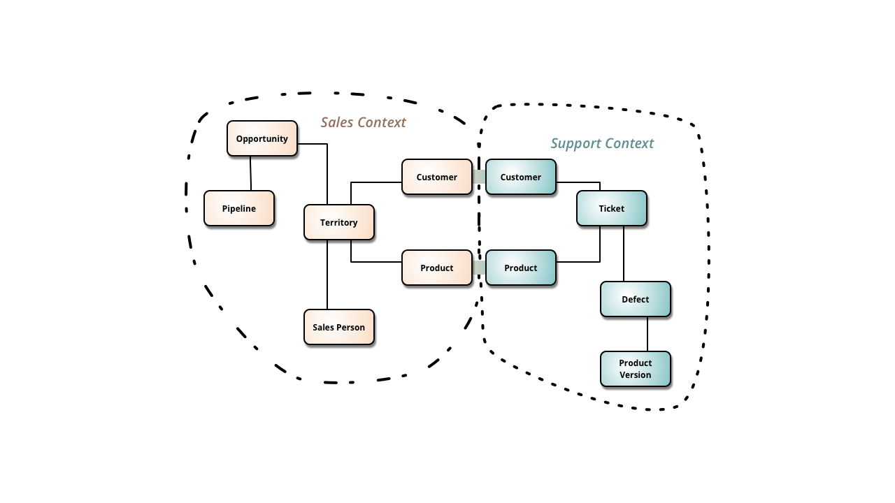

# Bounded Context

> A description of a boundary (typically the work of a particular business team) within which a particular model is defined and applicable.
> 
> Domain-Driven	Design Reference - 2015

## Example

> https://martinfowler.com/bliki/BoundedContext.html

> Total unification of the domain model for a large system will not be feasible or cost-effective
> 
> Eric Evans

* Any large project will start modeling multiple domains 
  * Shop Orders v.s. Membership Billing
  * Multi-Membership Discount v.s. Event Ticket ZIN Discount
  * Zin Play v.s. Zin Now
* Multiple Models are inevitable, but code that combines these models becomes buggy, unreliable, difficult to understand, difficult to maintain.

## Shared Kernel

* Sometimes code truly is *generic*.
* Classes and objects that are universally defined and can or should be used in all bounded contexts should be located in a universal shared kernel.
* Examples:
  * `Uuid`
  * `EmailAddress`
  * `Url`

### BE CAREFUL

The temptation to put inappropriate things in the shared kernel is **REAL**.

* Nobody wants to repeat themselves
* Just because something looks like a Duck and two bounded contexts use it does **NOT** mean it belongs in the kernel. 
* Resist your urges and just focus on your bounded context.

**Takeaway:**  Explicitly define context for every model, and do not allow code from one context to "share" code from another context.  Use a shared kernel for truly universal objects like IDs

