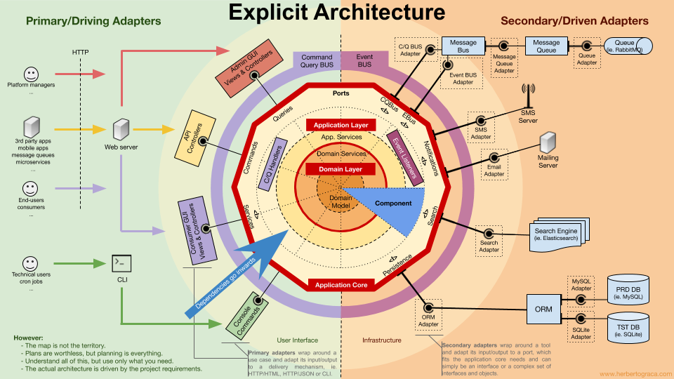

# Layered Architecture

## Important Concepts

* The domain layer should have no dependencies.
  * Pure classes
  * Pure functions
  * No hierarchy
* The domain layer operates **in memory**, not on a database.
  * Business logic is executed, no database changes
  * After the domain logic is complete, it can be persisted.
  * No/less need for transactions

